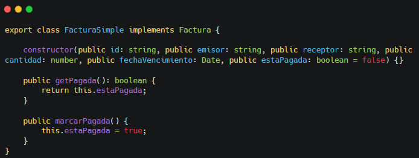
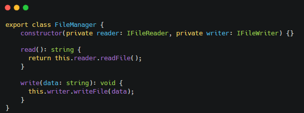

# Práctica 6 - Clases e interfaces genéricas. Principios SOLID.

**Autor** - Francisco Felipe Martín Vide (alu0101316062@ull.edu.es)

[](https://coveralls.io/github/ULL-ESIT-INF-DSI-2324/ull-esit-inf-dsi-23-24-prct06-generics-solid-franmv211?branch=main)

## Introducción y objetivos

En esta práctica, tendremos que resolver 5 ejercicios de programación en Typescript, con el objetivo de aprender a trabajar mejor con clases e interfaces genéricas en nuestros programas. Además, nuestro código también deberá respetar los principios SOLID vistos en clase.

Además de esto, también tendremos que seguir la meotodlogía TDD (**Test Driven Development**), lo que significa que también tendremos que llevar a cabo un conjunto de pruebas unitarias para cada ejercicio. Por último, también haremos uso de **Typedoc** para generar la documentación de nuestras funciones de forma "automática" y de otras herramientas como `nyc` y `coveralls` para llevar a cabo el cubrimiento de nuestro código y la visualización del mismo.

A continuación, veremos para cada uno de los ejercicios propuestos las soluciones implementadas junto con una breve explicación. Los enunciados a estos problemas los podemos encontrar [aquí](https://ull-esit-inf-dsi-2324.github.io/prct06-generics-solid/).

### Ejercicio 1 - La mudanza

En este ejercicio, se nos pedía implementar un sistema de gestión de mudanzas que manejase y organizace objetos o enseres dentro de cajas, que a su vez puediesen ser gestionadas para poder llevar a cabo la mudanza.

En primer lugar, se ha creado una interfaz `Enser`. Esta interfaz es fundamental para el desarrollo de nuestro código, pues nos va a permitir definir aquellas propiedades que va a necesitar cualquier objeto para que pueda ser almacenado en una caja. Esto hace nuestro programa más flexible y consistente.


A continuación, se ha implementando la clase `Caja`, la cual restringe su tipo, permitiendo que la caja almacene cualquier objeto que cumpla con la interfaz `Enser`. Esta clase es muy sencilla, cuenta con un *array* para almacenar los objetos `Enser`, un constructor con el identificador `id` de cada caja y una serie de metodos sencillos como:

- `agregarEnser` para meter un enser en la caja.
- `eliminarEnser` para sacar un enser de la caja.
- `cantidadEnseres` para contar el número de enseres que hay en la caja.
- `listarEnseres` para mostrar el nombre de todos los enseres que hay en la caja junto con su peso en kilogramos.
- `buscarEnser` para buscar un `Enser` determinado por su nombre.
- `pesoTotal` para calcular el peso total de la caja en kilogramos.


Por último, tenemos la clase `Mudanza`, que al igual que la clase `Caja`, restringe su tipo para que en la mudanza solo se gestionen cajas que contengan objetos que cumplan con lo establecido en la interfaz `Enser`. Esta clase también es muy sencilla. Cuenta con un *array* que representa la colección de cajas necesarias durante la mudanza y algunos métodos muy sencillos para gestionarlas, que son los siguientes:

- `agregarCaja` para agregar una caja a la colección.
- `eliminarCaja` para sacar una caja de la colección.
- `cantidadCajas` para contar el número de cajas de la colección.
- `listarCajas` para listar todas las cajas de la colección así como su contenido, haciendo uso del método `listarEnseres` de la clase `Caja`.
- `pesoTotalMudanza` para calcular el peso total de la mudanza mediante el peso de cada caja. Hace uso del método `pesoTotal` de la clase `Caja`.


### Ejercicio 2 - Facturas en diferentes formatos

El principio que se menciona en el ejercicio es el `Open-closed principle`, el cual sugiere que una clase debería estar abierta a la extensión pero no a la modificación. A continuación, veremos como se ha llevado a cabo el ejercicio para poder cumplir con este y con los demás principios.

En primer lugar, para poder añadir nuevos formatos de generación de facturas sin modificar el código implementado, se ha creado la interfaz `ExportadorFactura`, la cual cuenta con un método que recibe una `Factura` como argumento, y devuelve una representación de dicha factura en formato `string`.

La interfaz `Factura`, se ha creado para especificar la estructura de información que debe tener una factura.


A continuación, tenemos la clase `FacturaSimple`, la cual se encarga de almacenar la información especificada en la interfaz `Factura` y que además, cuenta con métodos para verificar si la factura está pagada, o marcarla como tal en caso de que no lo esté.



Luego, tenemos las clases `ExportadorHTML` y `ExportadorPDF`, que son implementaciones concretas de la interfaz `ExportadorFactura`. Cada clase nos permite exportar una factura en un formato específico. Esto demuestra el cumplimiento del `Open-closed principle`, pues si quisiéramos añadir nuevos formatos de exportación, lo podríamos hacer sin necesidad de modificar el código ya existente.


Por último, para poder hacer una correcta de la gestión de las facturas, se creó la clase `GestorFacturas`, la cual implementa la interfa `IGestorFacturas`, que define las operaciones necesarias que debe proporcionar nuestro gestor de facturas, como por ejemplo:

- `agregarFactura` para añadir una nueva factura al sistema.
- `obtenerFactura` para poder filtrar facturas por su ID.
- `exportarFactura` para poder exportar una factura en un formato en concretro.


### Ejercicio 3 - Gestor de ficheros

El código original proporcionado en este ejercicio viola el `Single responsability principle`, pues la clase `FileManager` gestiona tanto la lectura como la escritura de archivos, responsabilidades las cuales deberían separarse.

Para solucionar esto, se han creado dos interfaces, `IFileReader` e `IFileWriter`, y dos clases, `FileReader` y `FileWriter`.
Cada una de estas interfaces especifica unas obligaciones a cumplir, las cuales son la lectura y la escritura respectivamente. Es decir, que cualquier clase que implemente `IFileReader`, se "especializará" únicamente en la lectura de archivos, y cualquier clase que implemente `IFileWriter`, se enfocará exclusivamente en la escritura de archivos.


Las clases `FileReader` y `FileWriter` implementarán estas interfaces, asegurándonos de que cada clase tiene solo una razón para cambiar, cumpliendo así con el `Single responsability principle`.


Por último, se creó una clase `FileManager`, la cual nos permite cumplir con el `Dependency inversion principle`, ya que depende de abstracciones (las interfaces), en lugar de detalles concretos (las clases).



### Ejercicio 4 - Impresoras y escáneres

El código original proporcionado en este ejercicio viola el `Interface segregation principle`, pues las clases `Printer` y `Scanner` se ven obligadas a implementar una interfaz de la cual no necesitan todos sus métodos, lo que lleva a implementaciones vacías. Esto último es un claro indicador de que la interfaz es demasiado compleja y necesita ser simplificada.

Para cumplir con el `Interface segregation principle`, hemos dividido la interfaz `PrintableScannable` en dos interfaces más pequeñas, `Printable` para la impresión, y `Scannable` para el escaneo. De esta forma, las clases pueden implementar solo las interfaces que se corresponden con los métodos que ofrecen.


### Ejercicio 5 - Servicio de mensajería

El código proporcionado viola el `Dependency inversion principle`, pues la clase `Notifier` depende directamente de `EmailService` y `ShortMessageService`, en lugar de depender de abstracciones, lo que limita su flexibilidad y hace que el código sea más difícil ampliar o modificar.

Para solucionarlo, se ha creado la interfaz `INotificationService`, la cual representa la abstracción de los servicios de de notificaciones. De este modo, la clase `Notifier` depende de esta abstracción en lugar de las implementaciones de las clases `EmailService` y `ShortMessageService`.


### Ejercicio PE101

Este ejercicio, al ser bastante guiado, simplemente se siguieron los pasos del enunciado.

En primer lugar, se creó la interfaz genérica `Arithmeticable`, definiendo en ella los métodos `add`, `substract`, `multiply` y `divide`.


Luego, se implementó la clase genérica `ArithmeticableCollection`, la cual permite crear una colección de elementos de tipo `Arithmeticable`, lo que significa que cualquiero objeto dentro de la colección, puede realizar las operaciones anteriormente definidas en la interfaz con otros objetos del mismo tipo. Esta clase cuenta con los siguientes métodos:

- `addArithmeticable` para añadir un elemento a la colección.
- `getArithmeticable` para obtener un elemento de la colección según el índice indicado.
- `getNumberOfArithmeticables` para obtener el tamaño de la colección.


Por último, se han creado las clases `Complex` y `Rational`, las cuales representan números complejos y números racionales respectivamente.

Ambas clases implementan la interfaz `Arithmeticable`, restringiendo su tipo a si mismas. Esta restricción nos asegura que las operaciones que se realicen haciendo uso de los métodos definidos en la interfaz `Arithmeticable`, se realicen entre objetos del mismo tipo, véasoe `Complex` o `Racional`.


## Tests realizados

```
  Ejercicio 1 - Pruebas de Caja y Mudanza
    ✔ Caja - Agregar enseres
    ✔ Caja - Buscar enseres
    ✔ Caja - Enser no encontrado
    ✔ Caja - Eliminar enseres
    ✔ Caja - Peso total
    ✔ Caja - Listar enseres
    ✔ Caja - Listar caja sin enseres
    ✔ Mudanza - Agregar y eliminar cajas
    ✔ Mudanza - Peso total
    ✔ Mudanza - Listar cajas
    ✔ Mudanza - Listar cajas vacías

  Ejercicio 2 - FacturaSimple
    ✔ Se puede crear una factura simple
    ✔ Comprobar si una factura está pagada
    ✔ Marcar factura como pagada
    ✔ Se puede exportar a HTML
    ✔ Se puede exportar a PDF
    ✔ Se puede obtener una factura por su ID
    ✔ No se puede obtener una factura por un ID que no existe
Factura no encontrada.
    ✔ No se puede exportar una factura que no existe

  FileManager System
    FileReader
      ✔ should read the content of a file correctly
    FileReader
Error al leer el archivo: EACCES: permission denied, open './src/ejercicio-3/invalid.txt'
      ✔ should throw an error when trying to read from an invalid file
    FileWriter
Archivo escrito exitosamente.
      ✔ should write content to a file correctly
    FileWriter
Archivo escrito exitosamente.
      ✔ should throw an error when trying to write to an invalid file
    FileManager
      ✔ should read the content of a file correctly using FileManager
Archivo escrito exitosamente.
      ✔ should write and then read the updated content correctly using FileManager

  Ejercicio 4 - Pruebas
Printing...
    ✔ Printer
Scanning...
    ✔ Scanner
Printing...
    ✔ PrinterScanner
Scanning...
    ✔ PrinterScanner

  Ejercicio 5 - Servicio de mensajería
Sending notification by email: Hello World!
    ✔ Envía una notificación por correo electrónico
Sending notification by SMS: Hello World!
    ✔ Envía una notificación por SMS

  ArithmeticableCollection test
    ✔ debería añadir un complejo a la colección
    ✔ debería añadir un racional a la colección
    ✔ debería devolver el número de elementos de la colección de racionales
    ✔ debería devolver el número de elementos de la colección de complejos
    ✔ debería devolver el elemento de la colección indicado

  Rational test
    ✔ debería sumar dos números racionales
    ✔ debería restar dos números racionales
    ✔ debería multiplicar dos números racionales
    ✔ debería dividir dos números racionales

  Complex test
    ✔ debería sumar dos números complejos
    ✔ debería restas dos números complejos
    ✔ debería multiplicar dos números complejos
    ✔ debería dividir dos números complejos


  44 passing (53ms)
```

## Conclusiones

El desarrollo de esta práctica ha sido de gran ayuda para afianzar los conocimientos sobre clases e interfaces genéricas en `Typescript`. También, hemos aprendido lo fundamental sobre los principios SOLID. Todo esto, nos permite desarrollar un código mucho más flexible, robusto y claro, los cual es de vital importancia a la hora de trabajar en grupos, ya que si todos nos regimos por los mismos estándares, la colaboración se vuelve más eficiente y se reduce significativamente la curva de aprendizaje para los nuevos integrantes del equipo. Además, al utilizar a estos principios, facilitamos la escalabilidad y mantenibilidad del proyecto a largo plazo.

Si bien las dificultades en esta práctica han brillado por su ausencia, he de decir que tuve bastantes problemas para poder hacer funcionar la herramienta `Coveralls` correctamente, pues a pesar de tener todas las herramientas necesarias instaladas, así como el repositorio en público, no conseguía que este me apareciece en la web. Sin embargo, luego de cambiarle el nombre al repo, mágicamente, `Coveralls` decidió que era un buen momento para que la sincronización se llevase a cabo correctamente.

## Bibliografía

- [Clases e interfaces genéricas](https://ull-esit-inf-dsi-2324.github.io/typescript-theory/typescript-generics.html)
- [Principios SOLID](https://ull-esit-inf-dsi-2324.github.io/typescript-theory/typescript-solid.html)
